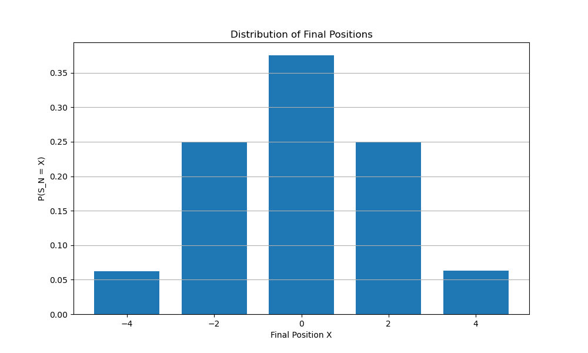
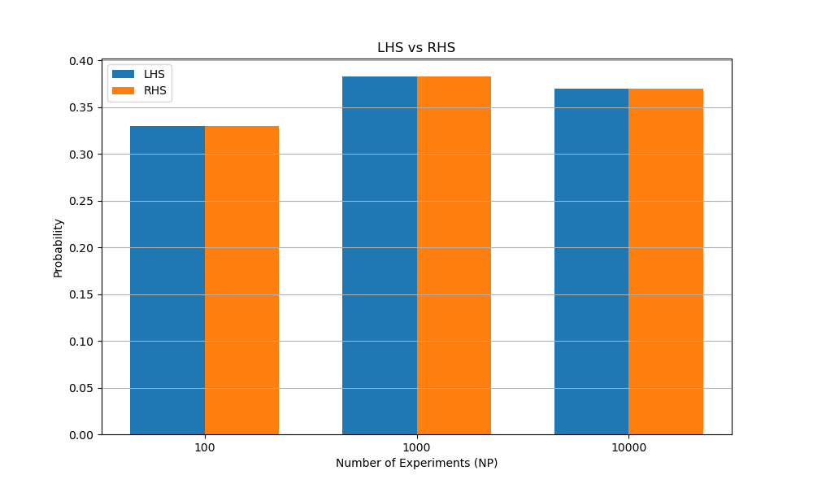

# Random Walk Probability Evolution

A simple Monte Carlo simulation written in pure Python to numerically verify the discrete one-step probability evolution equation for a one-dimensional symmetric random walk. Rather than jumping straight to differential equations, this project starts from elementary coin flips, tracks simulated trajectories, and checks how transition probabilities propagate discrete probability mass from step $N-1$ to step $N$.

---

## 1. Motivation

When studying stochastic processes, we often encounter master equations and continuum limits like the Fokker–Planck or diffusion equation early on. However, these continuous equations can feel abstract without seeing how they emerge from concrete microscopic rules.

I wanted to build an experiment from the ground up:
1. Start with the simplest discrete random process: a particle jumping $+1$ or $-1$ at each step with equal probability.
2. Simulate thousands of independent paths to estimate position distributions using raw frequencies.
3. Define conditional transition probabilities directly from simulated path histories.
4. Numerically check whether the fundamental discrete probability evolution equation holds between two successive time steps.

By building this step by step in vanilla Python without relying on heavy numerical libraries, I was able to follow every calculation explicitly—from individual step increments to cumulative sums and conditional filtering.

---

## 2. Random Walk Model

We consider a discrete-time, discrete-space random walk in one dimension. A particle starts at the origin $S_0 = 0$ at time step $0$.

At each step $i \ge 1$, the particle takes a displacement $\xi_i \in \{-1, +1\}$, where each direction has equal probability:

$$P(\xi_i = +1) = \frac{1}{2}, \quad P(\xi_i = -1) = \frac{1}{2}$$

The position of the walker after $N$ independent steps is the sum of these increments:

$$S_N = \sum_{i=1}^{N} \xi_i = \xi_1 + \xi_2 + \dots + \xi_N$$

Because each step changes the position by an odd integer ($\pm 1$), the parity of $S_N$ must match the parity of $N$. The particle can only land on values $X \in \{-N, -N+2, \dots, N-2, N\}$.

---

## 3. Probability Being Estimated

The primary quantity of interest is the probability that the walker is located at position $X$ after $N$ steps:

$$P(S_N = X)$$

In our Monte Carlo simulation with $NP$ independent paths, this probability is estimated by counting the fraction of paths whose cumulative displacement after $N$ steps equals $X$:

$$\widehat{P}(S_N = X) = \frac{\text{number of paths where } S_N = X}{NP}$$

---

## 4. Conditional Transition Probability

Next, we introduce the conditional transition probability $\Pi(X, Y, N, M)$, defined as the probability that the particle is at position $X$ at time step $N$, given that it was at position $Y$ at an earlier time step $M$ (with $M < N$):

$$\Pi(X, Y, N, M) = P(S_N = X \mid S_M = Y)$$

In the simulation, $\Pi(X, Y, N, M)$ is estimated empirically by:
1. Filtering through all $NP$ paths to find those that visited position $Y$ at step $M$ (let this count be `total`).
2. Among those specific paths, counting how many ended up at position $X$ at step $N$ (let this count be `count`).
3. Taking the ratio:

$$\widehat{\Pi}(X, Y, N, M) = \frac{\text{count}}{\text{total}} = \frac{\#\{S_N = X \text{ and } S_M = Y\}}{\#\{S_M = Y\}}$$

If no simulated path visited position $Y$ at step $M$ (`total == 0`), the function returns $0$.

> **Note on code design:** Although the current experiment specifically focuses on the single-step case ($M = N - 1$), the function `Pi` explicitly accepts $M$ as an argument so that multi-step transitions ($M < N - 1$) can be explored in future extensions without rewriting the transition logic.

---

## 5. One-Step Probability Evolution Equation

For the current experiment, we set the prior time step to:

$$M = N - 1$$

Because each step $\xi_N$ can only be $+1$ or $-1$, a walker can reach position $X$ at step $N$ from only two possible positions at step $N-1$:
- From $Y = X - 1$ (by taking a $+1$ step)
- From $Y = X + 1$ (by taking a $-1$ step)

By the law of total probability, the probability of being at $X$ at time $N$ can be partitioned across these two mutually exclusive incoming states:

$$\underbrace{P(S_N = X)}_{\text{LHS}} = \underbrace{\Pi(X, X-1, N, N-1) \, P(S_{N-1} = X-1) + \Pi(X, X+1, N, N-1) \, P(S_{N-1} = X+1)}_{\text{RHS}}$$

This is the **discrete one-step probability evolution equation** (or discrete master equation) for the random walk.

### Theoretical Transition Values
For an unbiased random walk:
- From $X - 1$, reaching $X$ requires $\xi_N = +1$, which has probability $1/2$:
  $$\Pi(X, X-1, N, N-1) = \frac{1}{2}$$
- From $X + 1$, reaching $X$ requires $\xi_N = -1$, which has probability $1/2$:
  $$\Pi(X, X+1, N, N-1) = \frac{1}{2}$$

Substituting these values into the evolution equation gives:

$$P(S_N = X) = \frac{1}{2} P(S_{N-1} = X-1) + \frac{1}{2} P(S_{N-1} = X+1)$$

This confirms that the probability at $(X, N)$ is simply the arithmetic average of the probabilities of its two neighboring sites at step $N-1$.

---

## 6. Monte Carlo Method

Rather than assuming theoretical transition probabilities, the simulation estimates every term in the equation independently from random data:

1. **Simulate paths:** Generate $NP$ random-walk paths, each consisting of $N$ random $\pm 1$ increments.
2. **Compute LHS:** Evaluate $\widehat{P}(S_N = X)$ directly by counting how many paths end at $X$.
3. **Compute RHS components:**
   - Estimate $\widehat{\Pi}(X, X-1, N, N-1)$ and $\widehat{\Pi}(X, X+1, N, N-1)$ from path trajectories.
   - Estimate $\widehat{P}(S_{N-1} = X-1)$ and $\widehat{P}(S_{N-1} = X+1)$ from path positions at step $N-1$.
4. **Evaluate RHS:**
   $$\text{RHS} = \widehat{\Pi}(X, X-1, N, N-1) \cdot \widehat{P}(S_{N-1} = X-1) + \widehat{\Pi}(X, X+1, N, N-1) \cdot \widehat{P}(S_{N-1} = X+1)$$
5. **Compare:** Calculate the absolute difference $|\text{LHS} - \text{RHS}|$ and inspect how the estimates behave as the ensemble size $NP$ varies across $100$, $1000$, and $10000$.

---

## 7. Implementation

The implementation is kept deliberately straightforward in [`b.py`](b.py). It uses standard Python lists, loops, and functions without unnecessary object-oriented wrappers or complex dependencies:

```
├── b.py               # Main simulation script
├── plots/             # Generated experiment plots
│   ├── Random_Walk _aths.png
│   ├── Distribution.png
│   └── LHSvsRHS.png
└── README.md
```

### Function Descriptions

- **`rg()`**  
  Uses `random.choice([1, -1])` to generate a single step increment with equal probability.

- **`sequence(N)`**  
  Calls `rg()` repeatedly to generate a list of $N$ random increments for a single path.

- **`paths(NP, N)`**  
  Calls `sequence(N)` for $NP$ iterations to construct the full ensemble of random-walk trajectories (a list of lists).

- **`path_sum(path, N)`**  
  Sums the first $N$ increments of a path to obtain the cumulative position $S_N$.

- **`P(X, N, path, NP)`**  
  Iterates over all $NP$ paths, checks if `path_sum(path[i], N) == X`, and returns the relative frequency $\text{count} / NP$.

- **`Pi(X, Y, N, M, NP, path)`**  
  Converts increment lists into cumulative position arrays, tracks paths where the position at index $M-1$ equals $Y$, and calculates the proportion of those paths that reach $X$ at index $N-1$.

---

## 8. Results

### 1. Random Walk Paths


This plot shows sample trajectories of the symmetric random walk starting from position $0$ at time step $0$. At each discrete time step, each path branches either $+1$ or $-1$. By time step $N = 4$, the trajectories have fanned out into a discrete lattice of accessible positions: $-4, -2, 0, 2, 4$.

---

### 2. Distribution of Final Positions



This bar chart shows the estimated probability distribution $P(S_N = X)$ at $N = 4$ obtained from the Monte Carlo simulation. 

Notice that:
- Odd positions have zero probability because $N = 4$ is even.
- The distribution is symmetric around $X = 0$.
- The central position $X = 0$ is the most probable outcome because there are more distinct paths that balance equal numbers of $+1$ and $-1$ steps.

---

### 3. LHS vs RHS Comparison



This graph compares the Monte Carlo estimate of the **LHS** (blue) against the **RHS** (orange) of the discrete evolution equation for $X = 0$ at $N = 4$ across three sample sizes:
- $NP = 100$
- $NP = 1000$
- $NP = 10000$

**Key Observation:** For each sample size, the blue bar (LHS) and orange bar (RHS) match almost exactly. 

The probability value itself does not converge to zero; rather, as $NP$ increases from $100$ to $10000$, Monte Carlo statistical fluctuations decrease and the estimated probability stabilizes around the true theoretical value ($\approx 0.375$).

---

## 9. Exact Distribution Check

Because the steps are independent Bernoulli trials mapped to $\pm 1$, the exact distribution of $S_N$ is binomial.

Let $k$ be the number of $+1$ steps out of $N$ total steps. The final position is:

$$X = k(+1) + (N - k)(-1) = 2k - N \implies k = \frac{N + X}{2}$$

Since $k$ must be an integer between $0$ and $N$, $P(S_N = X) > 0$ only when $N + X$ is even and $|X| \le N$. The exact theoretical probability is:

$$P(S_N = X) = \frac{1}{2^N} \binom{N}{\frac{N + X}{2}}$$

### Example: $N = 4$

For $N = 4$, the total number of possible paths is $2^4 = 16$. Evaluating each reachable state:

| Final Position $X$ | Number of $+1$ steps ($k$) | Number of Paths $\binom{4}{k}$ | Theoretical $P(S_4 = X)$ | Decimal Value |
| :---: | :---: | :---: | :---: | :---: |
| $-4$ | $0$ | $\binom{4}{0} = 1$ | $1/16$ | $0.0625$ |
| $-2$ | $1$ | $\binom{4}{1} = 4$ | $4/16$ | $0.2500$ |
| $0$ | $2$ | $\binom{4}{2} = 6$ | $6/16$ | $0.3750$ |
| $+2$ | $3$ | $\binom{4}{3} = 4$ | $4/16$ | $0.2500$ |
| $+4$ | $4$ | $\binom{4}{4} = 1$ | $1/16$ | $0.0625$ |

The bar heights in `Distribution.png` and `LHSvsRHS.png` match these exact fractions closely ($0.0625, 0.25, 0.375, 0.25, 0.0625$), validating the simulation.

---

## 10. Interpretation

The numerical agreement between LHS and RHS illustrates how conservation of probability works locally on a discrete lattice:

1. **Path-level consistency:** Every path that lands on $X$ at step $N$ had to pass through either $X-1$ or $X+1$ at step $N-1$. When we decompose the sample paths conditionally, the total frequency at $X$ naturally partitions into the sum of frequencies arriving from $X-1$ and $X+1$.
2. **Sampling variance vs. structural identity:** Within any given set of paths, the partitioned frequencies on the RHS add up to the total frequency on the LHS. As $NP$ increases, the estimated quantities $\widehat{P}$ and $\widehat{\Pi}$ fluctuate less from run to run, converging toward their theoretical ensemble values.

---

## 11. Limitations

To keep this project scientifically honest, several constraints should be stated clearly:

- **Numerical verification, not analytical proof:** The simulation demonstrates that the discrete equation holds within empirical sampling accuracy; it does not replace a formal mathematical proof.
- **Finite sample size:** Monte Carlo estimates inherently carry statistical uncertainty (proportional to $1/\sqrt{NP}$). Small sample sizes ($NP = 100$) exhibit noticeable variance.
- **One-step restriction:** The current experiment tests only the adjacent step case $M = N - 1$.
- **Not a proof of Fokker–Planck:** The Fokker–Planck equation is a continuous partial differential equation. While continuous diffusion can be derived mathematically from a random walk by taking a continuum limit ($\Delta t \to 0$, $\Delta x \to 0$ with $\Delta x^2 / \Delta t$ held constant), this discrete simulation does not solve, simulate, or prove the continuous PDE.

---

## 12. Future Work

This project forms a modular starting point that can be extended in several directions:

1. **Multi-step transitions ($M < N - 1$):** Generalize the one-step test to arbitrary previous times $M$ by summing over all reachable intermediate states $Y$:
   $$P(S_N = X) = \sum_{Y} \Pi(X, Y, N, M) \, P(S_M = Y)$$
2. **Chapman–Kolmogorov relation:** Verify the two-step transition composition rule between times $N_1 < N_2 < N_3$:
   $$\Pi(X, Z, N_3, N_1) = \sum_{Y} \Pi(X, Y, N_3, N_2) \, \Pi(Y, Z, N_2, N_1)$$
3. **Transition probability matrices:** Represent the transition probabilities as stochastic matrices and compute multi-step transitions via matrix multiplication.
4. **Continuum limit investigation:** Study how the discrete probability evolution equation approaches the continuous diffusion / Fokker–Planck PDE under diffusive scaling $\Delta x \sim \sqrt{\Delta t}$.
5. **Convergence quantification:** Systematically measure the Monte Carlo error $| \widehat{P} - P_{\text{exact}} |$ across a broader range of $NP$ to verify $1/\sqrt{NP}$ scaling.

---

## 13. How to Run

### Prerequisites

The code uses standard Python 3 and requires `matplotlib` for generating plots:

```bash
pip install matplotlib
```

### Running the Script

Run the script from your terminal:

```bash
python b.py
```

### Example Input Session

When prompted, enter your experimental parameters:

```text
Enter No. of Experiments: 10000
Enter X: 0
Enter N: 20
```

**Parameter explanations:**
- `No. of Experiments (NP)`: Total number of independent random-walk paths to simulate (e.g. `10000`).
- `X`: Target final position to evaluate (e.g. `0`). Must have the same parity as $N$ to have non-zero probability.
- `N`: Total number of time steps (e.g. `20`). The script automatically sets $M = N - 1 = 19$.

The script will output the transition values $\Pi$, component probabilities, LHS, RHS, absolute error, and then sequentially display the three plots.
